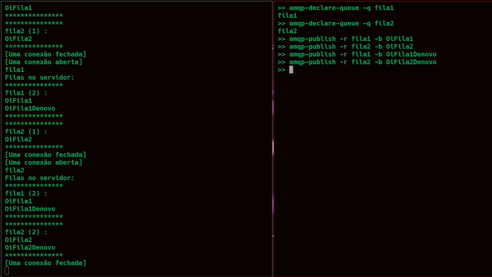

# Servidor-AMQP

Implementação de um servidor AMQP simplificado

## Visão geral do projeto

Esse projeto foi feito como trabalho de uma disciplina que fiz de Redes de Computadores.
https://uspdigital.usp.br/janus/Disciplina?sgldis=MAC5910

O projeto consiste na construção de um servidor simplificado que implementa o protocolo AMQP na versão 0.9.1.

De acordo com a página principal do RabbitMq: 

"AMQP 0-9-1 (Advanced Message Queuing Protocol) é um protocolo de mensagens que permite que aplicativos clientes em conformidade se comuniquem com intermediários de middleware de mensagens em conformidade."

Um servidor que implementa um protocolo desse tipo é chamado de servidor *broker*. Em resumo, *brokers* recebem mensagens dos *publishers* (clientes que as publicam, também conhecidos como produtores) e as encaminham para os *consumers* (clientes que as processam).

Por se tratar de um protocolo de rede, os *publishers*, os *consumers* e o broker podem residir em máquinas diferentes. Para uma visão geral de como o protocolo funcionar, veja a página https://www.rabbitmq.com/tutorials/amqp-concepts.html#overview e o arquivo slides.pdf.

Nesse projeto, implementei uma versão simplificada do servidor RabbitMQ, que somente precisa aceitar conexões e desconexões de clientes, receber e enviar mensagens em uma fila especı́fica sem se preocupar com falhas e sem se preocupar com autenticação ou criptografia. Além disso, de forma parecida com o comportamento do servidor RabbitMQ, o broker implementado envia mensagens aos consumidores em um esquema Round Robin (https://www.rabbitmq.com/tutorials/tutorial-two-python.html). Foram utilizados os utilitários amqp-declare-queue, amqp-publish e amqp-consume do pacote amqp-tools para os testes e correção do servidor.

## Requisitos para executar o servidor

Abaixo descrevo requisitos (na verdade são condições suficientes para executar o projeto, visto que essas foram as condições no ambiente de testes) precisa se certificar que possui: 

    - Uma maquina x86_64 rodando GNU/Linux (só foi testado para esse sistema)

    - Um compilador GCC

    - Suporte a threads (```pthread```)

## Build e execução

Para compilar o servidor, rode ```make```.

Depois de compilado, para rodar o servidor broker, execute:

    ```broker 5672```

O único argumento do programa é o número da porta em que o servidor vai escutar por conexões. Evidentemente, você pode escolher a porta de sua preferência. O número da porta AMQP padrão foi atribuído pela IANA como 5672 para TCP e UDP e por isso é recomendável o uso desse número de porta. A porta UDP é reservada para uso em futuras implementações multi-cast.

## Configurações do servidor

Algumas configurações do servidor podem ser configuradas em tempo de compilação. O arquivo server_config.h define algumas macros que podem ser ajustadas. Por enquanto, o servidor suporta a configuração de duas opções conforme descrito nesse arquivo.

    - MAX_NUM_QUEUE : Número máximo de filas que podem viver na memória em um dado instante 

    - MAX_CLIENTS : Número máximo de clientes conectados a qualquer instante no servidor

Por padrão essas macros valem 8 e 100 respectivamente.

## Exemplo de uso 




## 


